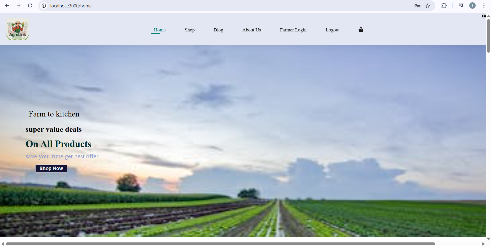
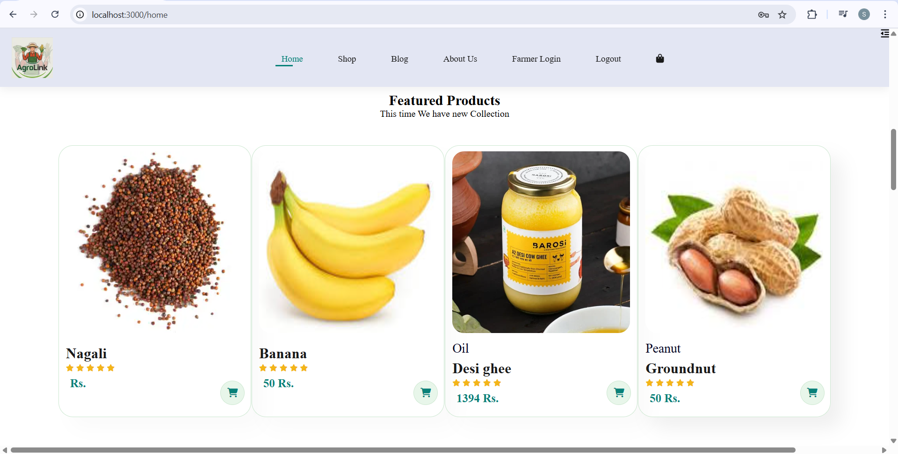

# AgroLink

An e-commerce website connecting farmers directly with consumers, allowing them to sell and buy fresh produce, seeds, tools, and agricultural products online.
## 🌾 Features

- Farmer and consumer login/registration
- Product listing by farmers
- Cart and checkout functionality for consumers
  -login for both farmer and consumer

  ## 💻 Tech Stack

- Frontend: HTML/CSS, JavaScript 
- Backend: Node.js, Express
- Database: MongoDB 
- Authentication: JWT

  ## 📦 Setup Instructions
  nodemon start

## 📸 Screenshots

### 🏠 Homepage

### 🛒 Product Page

